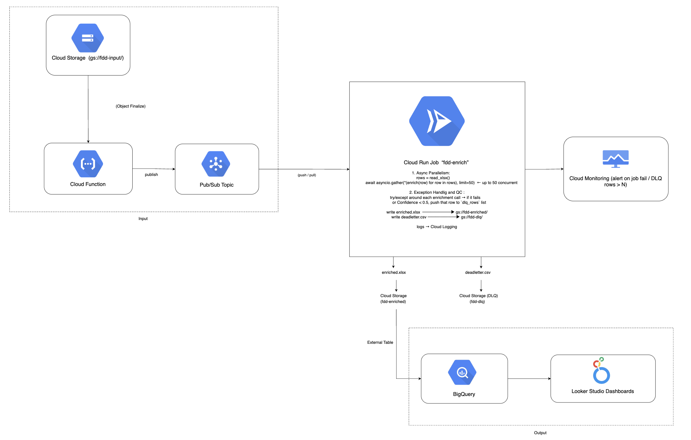

## High Level Architecture

## Architecture – Components & Interactions

| # | Component | Role |
|---|-----------|------|
| **1** | **Cloud Storage – `fdd-input/`** | Landing bucket for raw `.xlsx` files exported from Franchise Disclosure Documents. Upload is the only manual step. |
| **2** | **Cloud Function (Object Finalize)** | Triggered on every new object in `fdd-input/`; publishes file URI to Pub/Sub. |
| **3** | **Pub/Sub Topic** | Work queue that buffers events; allows horizontal scaling of processing jobs. |
| **4** | **Cloud Run Job `fdd-enrich`** | Container that downloads the spreadsheet, runs up to 50 parallel rows+ Perplexity tasks with `asyncio.gather`, writes `enriched.xlsx` and `deadletter.csv` back to Cloud Storage. |
| **5** | **Cloud Storage – `fdd-enriched/` & `fdd-dlq/`** | Stores final workbooks and dead‑letter rows for QA. |
| **6** | **BigQuery External Table** | Points at enriched files; new data auto‑available for SQL and BI. |
| **7** | **Looker Studio Dashboards** | Visualises BigQuery data (state distribution, confidence histogram, etc.). |
| **8** | **Cloud Logging ➔ Cloud Monitoring** | Captures job logs; alert policies notify on job failure or DLQ overflow. |

### Flow

1. Analyst uploads Excel → **Cloud Storage**.  
2. **Cloud Function** converts event → Pub/Sub message.  
3. **Cloud Run Job** consumes message, runs enrichment pipeline in parallel, writes outputs.  
4. **BigQuery** external table surfaces enriched data; **Looker Studio** dashboards refresh.  
5. Logs flow to **Cloud Monitoring**; alerts fire on errors or excessive low‑confidence rows.
